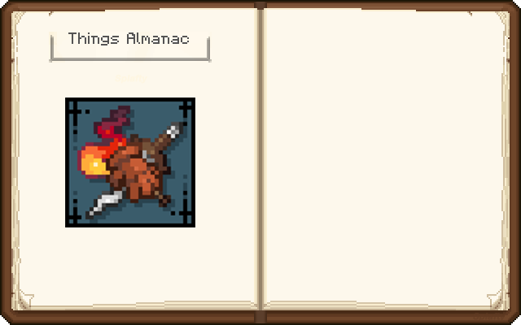

# Medieval MC [FABRIC] – Custom Quest Update

This project contains a heavily updated and expanded questline for the **Medieval MC [FABRIC] (MMC2)** modpack. Over 80 new quests have been added, alongside various improvements and fixes of older ones to enhance the gameplay and guide new or returning players more effectively.

## ✅ What's Included

- 🧭 **80+ New Quests**  
  Designed with balance and progression in mind, following the medieval theme of the modpack.

- ♻️ **Merged Quests from Other Modpacks**  
  Carefully selected, backported, and integrated with proper adjustments to maintain consistency.

- 🛠️ **Custom Titles, Descriptions, and Rewards**  
  All quests include:
  - Clear and informative titles
  - Descriptive, lore-friendly explanations
  - Fixed or redesigned rewards for proper balance
  - Logical dependencies and quest flow

- 📜 **Mistake Fixes & Polish of older quests**
  - Typos and inconsistencies corrected
  - Non-functional or confusing quests improved
  - Rewards that were broken or nonsensical have been fixed

- 🧠 **Player-Oriented Design**
  New quests highlight useful items and mechanics that players often struggle to find. Tips and guidance are included in descriptions to make the experience more fun!

- 🖼️ **Custom Quest Backgrounds**
  Enhanced visual immersion with personalized textures.

## 📁 Files & Structure

Included in this repository:
- `ftbquests/` – all updated and new quests, chapters, and reward tables
- `textures/` – custom textures and background images used in the UI
- `screenshots/` – preview images of the quest interface

## 🎨 Textures

**Don't forget to add the custom textures manually!**

Place the "textures" folder in your modpack directory or drag its contents to an existing one:
```
Medieval MC [FABRIC] MMC2\config\paxi\resourcepacks\Medieval Quest Assets\assets\medieval\textures
```

